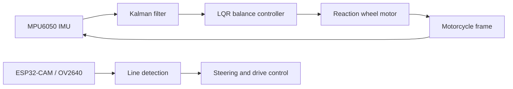

# 🎓 Graduation Thesis: Self-Balancing Electric Motorcycle

## Overview

This graduation thesis documents a small-scale self-balancing electric motorcycle built around a reaction wheel. The project started from the unstable-body problem: a two-wheel motorcycle frame cannot stay upright at low speed without an active balancing mechanism. The solution was to sense tilt angle, filter the noisy IMU signal, and command a reaction wheel motor to generate corrective torque.

The useful story here is the full engineering loop. The work moved from mechanical modeling and actuator design into a physical prototype, then compared PID and LQR controllers under disturbance, and finally added a camera-based line tracking extension.

<figure>
  
  <figcaption style="color: var(--text-muted); font-size: 0.88rem; margin-top: 0.55rem;">Physical prototype used for balancing validation.</figcaption>
</figure>

## Project Scope

The thesis covered four connected parts:

- Mechanical analysis and reaction wheel design.
- Electrical system design with IMU sensing, motor drivers, microcontrollers, and power selection.
- Balancing controller design with PID as a baseline and LQR as the stronger controller.
- Vision-based line detection and tracking using camera data from the prototype.

The page intentionally leaves out long derivations, register tables, and appendix-level data. Those details matter in the report, but the public project page works better when it focuses on design decisions, implementation flow, and measured results.

## System Architecture

The balancing loop used the MPU6050 as the tilt sensor. Raw readings were noisy enough to create sudden angle spikes, so a Kalman filter was added before the controller. The controller then changed reaction wheel speed to push the frame back toward its upright position.

The line tracking extension used camera images to estimate the line position and direction. That data was converted into distance and angle errors for the steering and drive controller.

## Reaction Wheel Design

The prototype used an inertia wheel pendulum model. When the motorcycle frame tilts, the reaction wheel accelerates or decelerates, producing torque in the opposite direction. This made the project a good embedded-control problem because mechanical design, sensor quality, and controller tuning all affected the final behavior.

<figure>
  
  <figcaption style="color: var(--text-muted); font-size: 0.88rem; margin-top: 0.55rem;">Reaction wheel and balancing motor design from the thesis report.</figcaption>
</figure>

The model helped decide the direction of the mechanical design, but the real prototype still needed tuning. Motor torque limits, vibration, friction, and sensor noise made the hardware response less clean than the simulation.

## Embedded Sensing

The MPU6050 provided accelerometer and gyroscope data for tilt estimation. Raw IMU output was not stable enough to use directly in a balancing loop, so the firmware applied a Kalman filter to reduce sudden spikes and produce a smoother angle signal.

That filtering step was not just cosmetic. For an unstable system, the angle estimate is part of the control path. A noisy estimate can make the controller respond to measurement artifacts instead of real frame motion.

## Controller Work

PID was implemented first because it provided a simple baseline. It could bring the model back from simpler disturbance cases, but it did not handle asymmetric continuous load as well.

LQR was then tested because it considers the system state more directly. In simulation and prototype testing, LQR performed better when the frame had to recover under asymmetric continuous load. The final controller still needed hardware tuning after the MATLAB-derived gain matrix, because the real prototype included noise and disturbance that were not fully represented in the model.

The thesis validated the LQR controller under several scenarios:

- No external disturbance.
- Instantaneous sideways disturbance.
- Asymmetric continuous load.
- Forward motion on a rough table surface.
- Circular motion.

The related research paper reports that during prototype validation the tilt angle was often within about `+/-3 deg`.

## Vision-Based Line Tracking

After the balancing controller was working, the thesis extended the prototype with line detection and tracking. The camera pipeline compared binary thresholding and HSV thresholding for a black line on a white background. HSV thresholding was a better fit in the tested lighting conditions, and erosion/dilation were used to reduce image noise before extracting the line.

<figure>
  
  <figcaption style="color: var(--text-muted); font-size: 0.88rem; margin-top: 0.55rem;">Thresholding comparison used for the line detection pipeline.</figcaption>
</figure>

The line boundary was extracted from the processed image, then converted into tracking information: the line's relative position and direction in the camera frame.

<figure>
  
  <figcaption style="color: var(--text-muted); font-size: 0.88rem; margin-top: 0.55rem;">Line contour extracted from the camera frame.</figcaption>
</figure>

## Results

The project produced a working prototype and several measured results that are useful to keep public:

- LQR handled asymmetric continuous load better than the PID baseline.
- Prototype validation kept the tilt angle often within about `+/-3 deg` in the paper's reported scenarios.
- The prototype reached about `0.3 m/s` in balancing validation.
- The line tracking experiment reported a maximum tracking-point-to-line-center error of `+18.7 mm`.
- The steering angle range was constrained around `+/-45 deg`.

<figure>
  
  <figcaption style="color: var(--text-muted); font-size: 0.88rem; margin-top: 0.55rem;">Line tracking error during a curved section of the test path.</figcaption>
</figure>

## What I Would Emphasize Now

This project is strongest as a control-and-embedded-sensing case study. The most meaningful parts are not the longest equations in the report, but the decisions that connect them to hardware:

- Use the mechanical model to size and reason about the reaction wheel.
- Filter the IMU signal before controller feedback.
- Treat PID as a baseline, then compare it with LQR under harder disturbance.
- Validate the controller on the prototype, not only in simulation.
- Document the line tracking limits instead of hiding them.

## Limitations

The prototype was intentionally small, so it cannot represent every behavior of a full-size motorcycle. The allowable tilt range was limited by available motor torque. The line tracking extension also depended on a controlled black-line/white-background path, lighting conditions, camera quality, and low speed.

Those limits are still useful. They show where the next iteration should focus: lighter mechanical structure, stronger balancing actuator, higher quality vision input, and a tracking pipeline less dependent on controlled lighting.

## Research Paper

A related research paper, **"Study and Implementation of Self-Balancing Electric Motorcycle"**, condensed the modeling, sensing, and controller-validation parts of the thesis. It covers the reaction-wheel model, Kalman-filtered IMU angle estimation, PID/LQR comparison, and LQR validation on the physical prototype.

## References

- [Study and Implementation of Self-Balancing Electric Motorcycle](../../blog/self-balancing-electric-motorcycle-paper/) - related paper note for the thesis.
